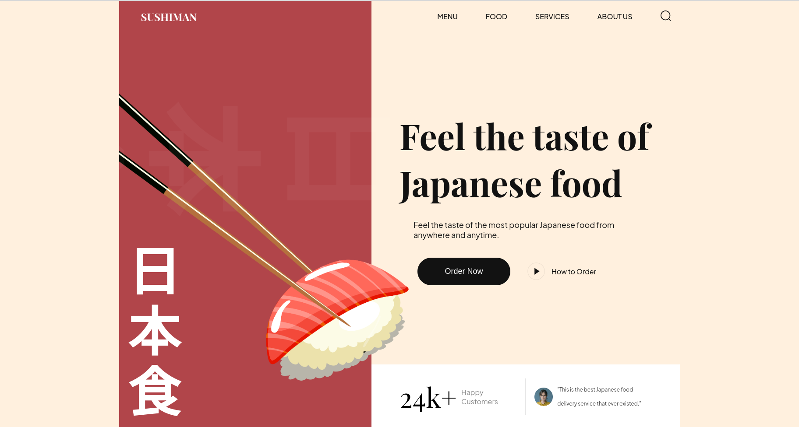

# Sushiman

This is a mock sushi resturant page made with HTML & CSS. The website is confgured to use on either desktop or mobile devices.


## Motivation:
Go back to the basics!

## Screenshot:

 


## Built with:

HTML
CSS
JS
VITE
AOS


## How to use?

```bash
npm install
npm run dev
```

## Contribute:

Feel free to a fork the repo or notify me of any issues that are present

## Credit:

JavascriptMastery's tutorial helped me create this project:
https://www.youtube.com/watch?v=QRrPE9aj3wI

## License:
 
MIT © BChainDev